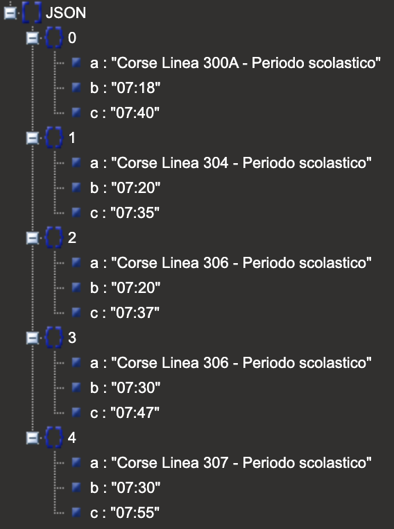

# Mediterraneabus API
[](https://paypal.me/fast0n)  [](https://github.com/Fast0n/mediterraneabus-api/blob/master/LICENSE) [](https://travis-ci.org/Fast0n/mediterraneabus-api) 

## Methods
#### search
Search for bus schedules and timetables for the Mediterraneabus S.p.A bus.

Parameters:
- periodo [required] - choice of period between 'invernale' and 'estiva'
- percorso_linea [required] - route bus line in the list data
- percorso_linea1 [required] - route bus line in the list data
- sort_by [optional] - choice of sort between 'time' and 'line'


Example Usage:
```
mediterraneabus-api.herokuapp.com/?periodo=invernale&
                                  percorso_linea=Ardore - stazione FS&
                                  percorso_linea1=Siderno - piazza Portosalvo
                                  &sort_by=time
```
Returns
The standard JSON array

- title lines
- bus stop
- timetables

## Methods
#### lista
Get list routes for the Mediterraneabus S.p.A bus.

Parameters:
- lista [optional] - empty


Example Usage:
```
mediterraneabus-api.herokuapp.com/?lista
```
Returns
The standard JSON array

- routes lines

# Result
